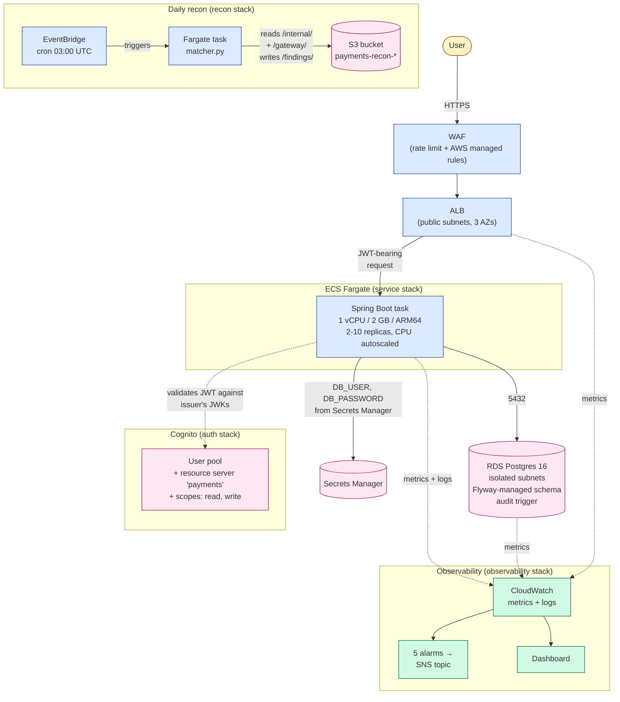

# payments-demo

A production-shaped payments system built end-to-end as a learning project:
HTTP service, single-page frontend, batch reconciliation job, AWS
infrastructure as code, CI pipelines. Not deployed; the infrastructure
synthesizes to valid CloudFormation but is never run against AWS.

The goal was to build something that *looks like real production code* —
visible decision-making in every layer, real concerns addressed (idempotency,
audit, secrets, observability), and known gaps called out rather than hidden.

## 5-minute tour

If you only have a few minutes, look at these three files:

1. **[`backend/src/main/java/com/example/payments/service/PaymentService.java`](backend/src/main/java/com/example/payments/service/PaymentService.java)**
   — Idempotency, retries, and the gateway contract. The exception
   hierarchy (`DeclinedException` non-retryable, `TransientException`
   retryable) means `@Retryable` only kicks in for safe cases. Idempotency
   uses a database unique constraint, not a distributed lock: cleaner,
   correct under race conditions.

2. **[`backend/src/main/resources/db/migration/V2__create_audit.sql`](backend/src/main/resources/db/migration/V2__create_audit.sql)**
   — Audit log owned by the database. An `AFTER INSERT/UPDATE` trigger
   writes to `payment_events` in the same transaction as the original
   change. Application code can't accidentally skip auditing; ops can't
   compromise the log without elevated DB privileges.

3. **[`infra/lib/service-stack.ts`](infra/lib/service-stack.ts)**
   — Where application meets cloud. ECS Fargate task, ALB, WAF,
   autoscaling, IAM, security groups. Wires the database URL from the
   data stack, the JWT issuer URL from the auth stack, and the database
   password from Secrets Manager directly into the running task's
   environment.

## Architecture

The deployable system, with the request path through it:



Solid arrows show the request path. Dotted arrows show out-of-band traffic
(JWT validation, metrics, secret retrieval). Everything runs in one VPC
spanning three AZs; the database has no internet route.

## Layout

```
backend/    Spring Boot 4 / Java 21 — HTTP service for payment authorization
frontend/   React + TypeScript + Vite — minimal UI exercising the backend
recon/      Python 3.12 — daily reconciliation between internal records and
            gateway settlement files
infra/      AWS CDK in TypeScript — six stacks composing the deployable
            system (network, auth, data, service, recon, observability)
.github/    GitHub Actions workflows for per-component CI
```

## More worth looking at

Beyond the three tour files:

**`backend/src/main/java/com/example/payments/controller/GlobalExceptionHandler.java`**
— Maps domain exceptions to HTTP responses with RFC 7807 Problem Detail
bodies. Validation errors become 400 with field-level messages; declines
become 422 with a reason code; transient failures become 503 so clients
know it's retryable.

**`recon/src/recon/matcher.py`** — Pure-function reconciliation. No I/O,
no state, no time. `find_mismatches(internal, gateway)` takes two iterables
and yields findings, one per discrepancy. Testable in isolation;
property-tested with hypothesis.

**`recon/src/recon/cli.py`** — Streaming CSV reader using generators, so
files larger than memory still work. The CLI in `cli.py` is where I/O
lives, kept distinct from the matcher's pure core.

**`frontend/src/api/payments.ts`** — Typed API client returning
`Result<T>` (a discriminated union). Callers must handle both branches
at compile time; no try/catch boilerplate at call sites.

**`infra/lib/data-stack.ts`** — RDS Postgres in isolated subnets with
credentials generated by Secrets Manager. The password never appears in
CDK code, CloudFormation templates, or environment variables — only the
secret's ARN moves around.

## Building locally

Postgres for local development:
```bash
docker compose up -d postgres
```

Backend:
```bash
cd backend
./mvnw spring-boot:run
```

Frontend:
```bash
cd frontend
npm install
npm run dev
```

Recon (one-off):
```bash
cd recon
python -m venv .venv && source .venv/bin/activate
pip install -e ".[dev]"
recon --internal examples/internal.csv --gateway examples/gateway.csv
```

Infrastructure synthesis (no deployment):
```bash
cd infra
npm install
npm run synth
```

## Production gaps

Knowingly deferred for scope:

- **No real OAuth2 issuer in local dev.** Cognito is configured in CDK
  but isn't deployed. The backend's `@PreAuthorize` annotations are
  correct but only enforced in the `prod` profile against a configured
  issuer. Local dev runs without auth.

- **No real payment gateway adapter.** `MockPaymentGateway` is the only
  implementation. The `prod` profile correctly fails to start without
  a real gateway (the mock is `@Profile("!prod & !staging")`).

- **Backend test coverage is service-only.** No controller, repository,
  or exception-handler tests yet. The service tests use the full Spring
  context against a real Postgres.

- **Application metrics live in /actuator/prometheus, not CloudWatch.**
  Micrometer exposes histograms and counters in Prometheus format. A
  real deployment would either run a Prometheus scraper sidecar or use
  CloudWatch Embedded Metric Format to bridge into CloudWatch.

- **Infrastructure is never actually deployed.** `cdk deploy` would work
  with real AWS credentials, but the project's goal is the code, not a
  running deployment. The deploy itself would be straightforward; the
  cost of maintaining a running deployment forever was not worth it.

- **HTTPS listener deferred.** The ALB has only a port 80 listener.
  Production would add port 443 with an ACM cert, which requires a real
  domain — out of scope for the demo.

## Stack

| Layer | Tech |
|---|---|
| Backend | Java 21, Spring Boot 4, Spring Data JPA, Flyway, Micrometer, Resilience4j |
| Frontend | React 18, TypeScript 5, Vite |
| Recon | Python 3.12, pytest, ruff, mypy strict |
| Infra | AWS CDK 2 (TypeScript), CloudFormation |
| CI | GitHub Actions (per-component workflows + orchestrator) |
| Database | PostgreSQL 16 |

## License

GNU General Public License v2.0 (see [LICENSE](LICENSE)).